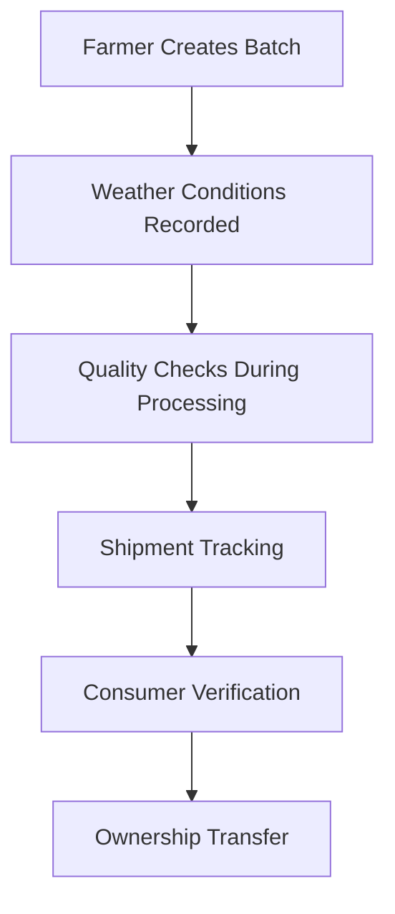

# Food Agriculture Supply Chain Management System

## Project Overview

This is a comprehensive **blockchain-based food and agriculture supply chain management system** built on the **Polygon blockchain**. The system tracks food products from farm to consumer, providing complete transparency, quality assurance, and real-time verification capabilities.

## System Architecture

The system consists of **four main layers**:

### 1. **Blockchain Layer** (Smart Contracts)
- Core business logic implemented in **Solidity**
- Deployed on **Polygon blockchain** for scalability
- **Oracle integration** for real-time data feeds

### 2. **Backend Services Layer**
- Weather API service for environmental data
- Price oracle integration
- File storage management

### 3. **Frontend Applications Layer**
- **Admin Portal**: For supply chain stakeholders
- **Public Portal**: For consumers and verification

### 4. **External Integrations**
- **OpenWeatherMap API** for weather data
- **Chainlink oracles** for price feeds
- **S3** for file storage

## Core Components

### Smart Contracts Structure

#### **Access Control System:**
- **`AccessControl.sol`**: Base permission system with roles (`FARMER`, `PROCESSOR`, `DISTRIBUTOR`, `SHIPPER`, `RETAILER`, `ADMIN`)
- **`StakeholderManager.sol`**: Handles registration, licensing, and partnerships
- **`StakeholderRegistry.sol`**: Read-only interface for stakeholder data

#### **Core Business Logic:**
- **`ProductBatch.sol`**: Manages product lifecycle from creation to consumer purchase
- **`OfferManager.sol`**: Handles trading operations and contract farming
- **`ShipmentTracker.sol`**: Tracks logistics and delivery status
- **`Registry.sol`**: Central marketplace and analytics engine

#### **Oracle Integration:**
- **`Price.sol`**: Chainlink price feeds for ETH/USD conversion
- **`Weather.sol`**: Weather data integration for farming suitability

#### **Verification System:**
- **`ProvenanceTracker.sol`**: Immutable supply chain history using Merkle trees
- **`QRCodeVerifier.sol`**: Consumer verification interface
- **`PublicVerification.sol`**: Public product authenticity checks

#### **Storage Management:**
- **`FileStorageManager.sol`**: Manages off-chain file references
- **`MetadataManager.sol`**: Structured metadata with schema validation

## Stakeholder Roles and Workflows

### **Farmer Workflow:**
1. Register as stakeholder through admin approval
2. Create product batches with quality metrics
3. List products for sale in marketplace
4. Manage weather-dependent trading conditions
5. Track batch ownership through supply chain

### *Processor Workflow:**
1. Browse available batches from farmers
2. Make purchase offers or enter contract farming agreements
3. Process raw materials with quality checks
4. Record processing conditions and certifications
5. List processed goods for distributors

### **Distributor Workflow:**
1. Purchase processed goods from processors
2. Create shipments for logistics tracking
3. Manage inventory and distribution networks
4. Transfer ownership to retailers

### **Shipper Workflow:**
1. Accept shipment assignments from distributors
2. Update shipment status and location tracking
3. Confirm deliveries to retailers
4. Maintain delivery records and performance metrics

### **Retailer Workflow:**
1. Receive products from distributors
2. List products for consumer purchase
3. Generate QR codes for consumer verification
4. Process consumer purchases and confirmations
5. Manage pickup and delivery logistics

### **Consumer Workflow:**
1. Browse products through public portal
2. Verify product authenticity via QR codes
3. View complete supply chain history
4. Purchase products from retailers
5. Confirm receipt and claim ownership

## Technical Implementation

### **Blockchain Infrastructure:**
- **Network**: Polygon (Amoy Testnet for development)
- **Framework**: Hardhat for development and deployment
- **Language**: Solidity 0.8.19 with optimizations enabled
- **Testing**: Comprehensive test suites for all contracts

### **Oracle Integration:**
- **Price Feeds**: Chainlink ETH/USD aggregators
- **Weather Data**: OpenWeatherMap API integration
- **Real-time Updates**: Automated feed updates via scripts

### **Frontend Applications:**
- **Technology**: React with TypeScript
- **Web3 Integration**: Ethers.js for blockchain interaction
- **Routing**: React Router for multi-page applications
- **Styling**: CSS modules with responsive design

### **Backend Services:**
- **Weather API**: Node.js service with OpenWeatherMap integration
- **File Storage**: Multi-provider support (S3)
- **Data Processing**: Real-time weather and price data processing

## Key Features

### **Trading Systems:**
- **Spot Market**: Immediate buy/sell transactions
- **Contract Farming**: Pre-arranged agreements between farmers and processors
- **Cooperative Trading**: Group-based trading mechanisms
- **Weather-Dependent Trading**: Trades contingent on environmental conditions

### **Quality Assurance:**
- Batch-level quality tracking throughout supply chain
- Processing condition recording with weather data
- Certification management and verification
- Consumer-facing quality metrics display

### **Verification Capabilities:**
- QR code generation for each product batch
- Complete supply chain history tracking
- Public verification without authentication required
- Immutable provenance records using Merkle trees

### **Analytics and Reporting:**
- Real-time market analytics and pricing trends
- Stakeholder performance dashboards
- Supply chain efficiency metrics
- Weather impact analysis on product quality

## Deployment and Configuration

### **Development Setup:**
1. Install Node.js and npm dependencies
2. Configure environment variables for API keys
3. Run Hardhat local blockchain network
4. Deploy smart contracts using deployment scripts
5. Start frontend applications in development mode

### **Production Deployment:**
1. Deploy contracts to Polygon mainnet
2. Configure oracle feeds with production data sources
3. Set up file storage infrastructure
4. Deploy frontend applications to hosting platforms
5. Configure monitoring and logging systems

### **Environment Variables:**
```bash
POLYGON_RPC_URL=<Polygon network RPC endpoint>
PRIVATE_KEY=<Deployment account private key>
OPENWEATHER_API_KEY=<Weather API access key>
ETHERSCAN_API_KEY=<Contract verification key>
```

### **Testing Framework:**
- **Unit Tests**: Individual contract function testing
- **Integration Tests**: Cross-contract interaction testing
- **End-to-End Tests**: Complete workflow testing
- **Gas Optimization**: Performance and cost analysis

## Security Considerations

### **Access Control:**
- Role-based permissions enforced at contract level
- Multi-signature admin functions for critical operations
- Stakeholder verification through license key system
- Partnership management for authorized trading relationships

### **Data Integrity:**
- Immutable record keeping using blockchain storage
- Merkle tree verification for provenance chains
- Oracle authorization to prevent data manipulation
- Emergency controls for system maintenance

### **Smart Contract Security:**
- Reentrancy protection on all payable functions
- Input validation and bounds checking
- Safe math operations to prevent overflow/underflow
- Comprehensive testing coverage for edge cases

## Monitoring and Maintenance

### **System Monitoring:**
- Real-time transaction monitoring and alerting
- Oracle feed health checks and failover mechanisms
- Smart contract event logging and analysis
- Performance metrics tracking and optimization

### **Upgrade Mechanisms:**
- Proxy pattern implementation for contract upgrades
- Migration scripts for data preservation
- Backward compatibility maintenance
- Staged deployment and rollback procedures

## Business Logic Flow

### **Product Lifecycle:**


### **Trading Mechanisms:**
1. **Product listing** with market price integration
2. **Offer creation** and negotiation between stakeholders
3. **Contract farming** agreements with predetermined terms
4. **Payment processing** and ownership transfer
5. **Analytics recording** for market intelligence

### **Verification Process:**
1. **QR code generation** tied to specific batch
2. **Consumer scans** code for authenticity check
3. **Complete supply chain** history displayed
4. **Quality metrics** and certifications shown
5. **Farmer and processor** reputation scoring

### **File Storage Integration:**
1. Product images and documents uploaded to **distributed storage**
2. Metadata references stored on **blockchain**
3. Content addressing for **tamper-proof** file verification
4. **Multi-provider redundancy** for availability

## Directory Structure

```
Food_agriculture_supply_chain/
├── src/SmartContracts/          # Solidity smart contracts
│   ├── access/                  # Access control contracts
│   ├── core/                    # Core business logic
│   ├── Oracles/                 # Price and weather oracles
│   ├── storage/                 # File and metadata storage
│   └── verification/            # Provenance and QR verification
├── frontend/
│   ├── admin-portal/            # Stakeholder management UI
│   └── public-portal/           # Consumer verification UI
├── services/                    # Backend API services
├── scripts/                     # Deployment and testing scripts
├── test/                        # Smart contract tests
└── deployments/                 # Contract deployment artifacts
```

## Getting Started

### **Prerequisites:**
- Node.js 16+
- npm or yarn
- MetaMask or compatible Web3 wallet
- Polygon testnet tokens for deployment

### **Quick Start:**
```bash
# Clone the repository
git clone <repository-url>
cd Food_agriculture_supply_chain

# Install dependencies
npm install

# Configure environment
cp .env.example .env
# Edit .env with your API keys

# Start local blockchain
npx hardhat node

# Deploy contracts
npm run deploy:local

# Start admin portal
cd frontend/admin-portal
npm start

# Start public portal (separate terminal)
cd frontend/public-portal
npm start
```

This system provides a **complete end-to-end solution** for agricultural supply chain management, combining **blockchain transparency** with **real-world usability** through comprehensive stakeholder workflows and consumer verification capabilities.